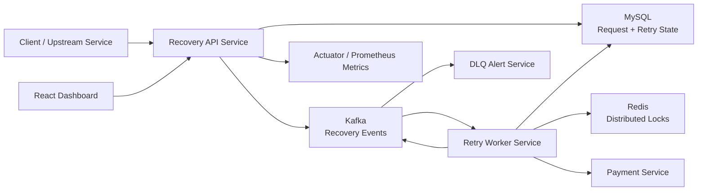
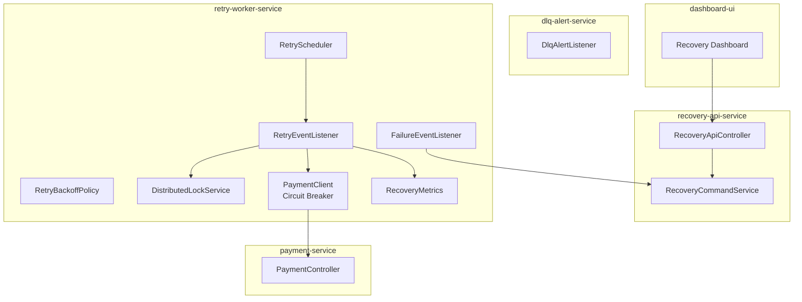
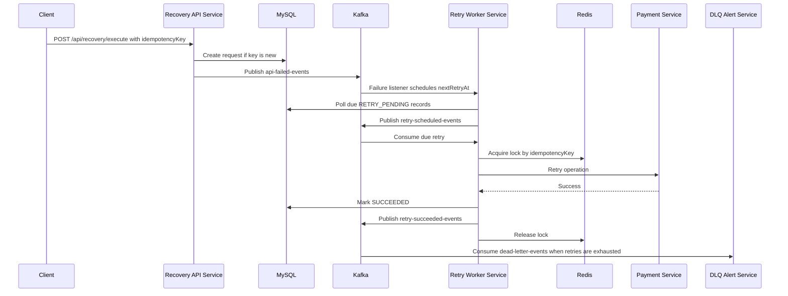

# High Level Design

## Goal

Build a distributed microservices-based failure recovery system that detects failed operations, retries recoverable failures intelligently, prevents duplicate execution, and moves unrecoverable work to a dead letter queue for investigation.

## Key Capabilities

- Detect failed API/downstream operations
- Classify failures as temporary or permanent
- Retry temporary failures using exponential backoff
- Prevent duplicate processing through idempotency keys
- Prevent concurrent retry execution through Redis distributed locks
- Publish recovery lifecycle events through Kafka
- Persist all request and retry state in MySQL
- Expose health and recovery metrics for operations teams
- Stop cascades through a circuit breaker

## Context Diagram



## Component Architecture



## Event Flow



## Data Ownership

MySQL is the source of truth for:

- Original request payload
- Idempotency key
- Current recovery status
- Attempt count
- Next retry time
- Last error
- Final outcome

Kafka is used for asynchronous coordination and observability events. Redis is used only for short-lived distributed locks.

## Failure Classification

| Type | Meaning | Action |
| --- | --- | --- |
| `TEMPORARY` | Timeout, network failure, transient dependency issue | Retry with exponential backoff |
| `PERMANENT` | Validation failure, business rule rejection, unrecoverable downstream response | Mark permanent failure and publish DLQ event |
| `NONE` | Simulated successful path | Mark succeeded |

## Retry Strategy

Formula:

```text
delay = min(initialDelay * 2^(attemptCount - 1), maxDelay)
```

Default values:

- Initial delay: 5 seconds
- Max delay: 300 seconds
- Max attempts: 5

## Consistency Model

The system uses at-least-once event delivery and makes processing idempotent:

- The unique `idempotencyKey` prevents creating or executing duplicate requests.
- MySQL stores current status and attempt count.
- Redis lock prevents multiple service instances from retrying the same key at the same time.
- Kafka consumers are allowed to receive duplicate events; DB status checks make duplicates harmless.

## Monitoring

Actuator exposes:

- `/actuator/health`
- `/actuator/metrics`
- `/actuator/prometheus`
- `/actuator/circuitbreakers`

Custom metrics:

- `recovery_failures_total`
- `recovery_retry_success_total`
- `recovery_retry_failure_total`
- `recovery_dead_letter_total`
