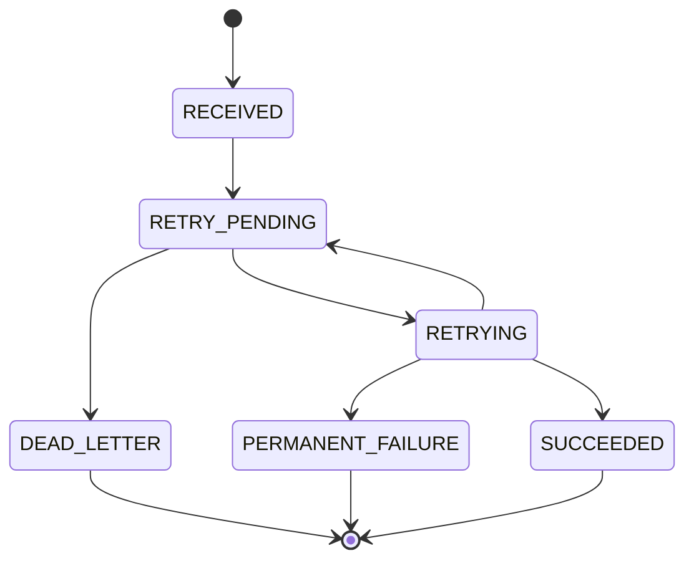

# Low Level Design

## Microservice Structure

```text
automated-failure-recovery-system
|-- common-events
|   `-- shared event DTOs, enums, JPA entity, repository
|-- recovery-api-service
|   `-- request API, idempotency, Kafka failure event publishing
|-- retry-worker-service
|   `-- retry scheduler, Kafka consumers, Redis locks, payment client, circuit breaker
|-- dlq-alert-service
|   `-- dead-letter event consumer and alert logging
|-- payment-service
|   `-- simulated downstream payment microservice
`-- dashboard-ui
    `-- React dashboard for operational visibility and demo flows
```

## Frontend Dashboard

The `dashboard-ui` service is a React/Vite app served by Nginx on port `3000`.

It calls:

- `GET /api/recovery` to show live recovery records
- `POST /api/recovery/execute` to create success, temporary failure, and permanent failure scenarios

The dashboard displays:

- Total request count
- Successful recoveries
- Pending retry count
- Active retry count
- Permanently closed count
- Retry success rate
- Request table with status, attempts, next retry time, and last error

The browser calls `recovery-api-service` through `http://localhost:8080`, and CORS is enabled for local dashboard origins.

## Database Model

Table: `recovery_requests`

| Column | Purpose |
| --- | --- |
| `id` | Primary key |
| `idempotency_key` | Unique request key that prevents duplicate execution |
| `operation_type` | Logical operation such as `PAYMENT` |
| `payload` | Original operation payload |
| `status` | Current recovery state |
| `failure_type` | Simulated/classified failure type |
| `attempt_count` | Number of downstream execution attempts |
| `failures_before_success` | Demo field for transient failure simulation |
| `next_retry_at` | Time after which retry is eligible |
| `last_error` | Most recent failure message |
| `created_at` | Creation timestamp |
| `updated_at` | Last mutation timestamp |
| `version` | Optimistic locking version |

Indexes:

- Unique index on `idempotency_key`
- Composite index on `status,next_retry_at` for scheduler polling

## State Machine



## API Endpoints

### Execute Operation

```http
POST /api/recovery/execute
Content-Type: application/json
```

Body:

```json
{
  "idempotencyKey": "order-1002",
  "operationType": "PAYMENT",
  "payload": "{\"amount\":900}",
  "failureMode": "TEMPORARY",
  "failuresBeforeSuccess": 2
}
```

Behavior:

- If `idempotencyKey` already exists, returns the existing record.
- If new, stores the request and publishes `api-failed-events`.
- The retry worker later calls the payment service.
- Permanent failures publish `dead-letter-events`.

### Get Request

```http
GET /api/recovery/{idempotencyKey}
```

### List Recent Requests

```http
GET /api/recovery
```

## Kafka Events

Record:

```java
RecoveryEvent(
    eventId,
    idempotencyKey,
    operationType,
    status,
    failureType,
    attemptCount,
    message,
    nextRetryAt,
    occurredAt
)
```

Topics:

| Topic | Producer | Consumer | Purpose |
| --- | --- | --- | --- |
| `api-failed-events` | `recovery-api-service` | `retry-worker-service` | Schedule retry after initial failure |
| `retry-scheduled-events` | `retry-worker-service` | `retry-worker-service` | Execute due retry |
| `retry-succeeded-events` | `retry-worker-service` | Observability | Retry success notification |
| `retry-failed-events` | `retry-worker-service` | Observability | Retry failure notification |
| `dead-letter-events` | `retry-worker-service` / `recovery-api-service` | `dlq-alert-service` | Exhausted or permanent failure |

## Idempotency Design

The idempotency key is mandatory for every request.

Implementation:

- `recovery_requests.idempotencyKey` has a unique index.
- `RecoveryCommandService.execute` checks for an existing key before creating work.
- If the same key is submitted again, the API returns the current stored state instead of creating a duplicate flow.

This protects payment/order operations from duplicate execution.

## Distributed Locking Design

Before retrying, the consumer calls:

```text
SET recovery:lock:{idempotencyKey} locked NX EX {ttl}
```

Only the instance that acquires the Redis key can execute the retry. The lock has a TTL so a crashed worker does not block the key forever.

## Circuit Breaker Design

`PaymentClient.execute` is protected with:

```java
@CircuitBreaker(name = "paymentService")
```

Config:

- Count-based window size: 10
- Failure threshold: 50%
- Minimum calls: 5
- Open-state wait: 30 seconds
- Half-open trial calls: 3

When the downstream payment service is unhealthy, the circuit opens and prevents continuous failure cascades.

## Retry Algorithm

1. API creates a recovery request.
2. API publishes `api-failed-events`.
3. Worker sets `nextRetryAt` using exponential backoff.
4. Scheduler scans `RETRY_PENDING` rows where `nextRetryAt <= now`.
5. Scheduler publishes `retry-scheduled-events`.
6. Retry listener acquires Redis lock.
7. Retry worker calls `payment-service`.
8. Success marks `SUCCEEDED`; failure schedules again or moves to DLQ.

## Local Demo Assumptions

The downstream operation is simulated by a separate `payment-service`, so local execution still demonstrates a real service-to-service boundary. In production, the same retry worker pattern can target payment, order, inventory, refund, or notification services.
